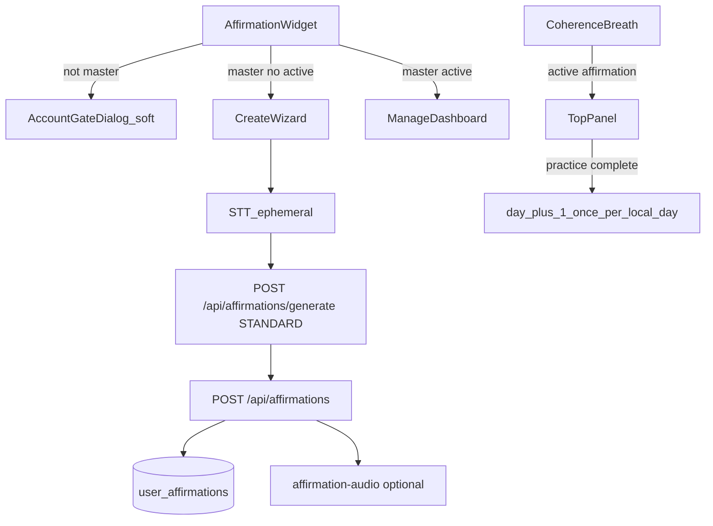

# Personal Affirmation / Sankalpa — план реализации

updated: 2026-08-14  
status: awaiting_confirm (audio storage + «делай»)

## Решения пользователя (зафиксировано)

1. **Доступ — только Master.** Клик не-мастера → мягкий `AccountGateDialog` в духе «Начать практику» (`gate.body.practices` / отдельный `gate.body.affirmation` про дыхательные практики + Личный кабинет). Не пугать модераторов формулировкой «нет доступа».
2. **День X из 30:** +1 не чаще 1 раза в локальные сутки при успешном завершении дыхательной практики (`results` 100%).
3. **Панели в дыхании:**
   - **Старт:** с onset первого **выдоха** до onset следующего выдоха (~1 цикл) — панель сверху с текстом, затем уезжает вверх.
   - **Финал:** последние **3 выдоха** — панель сверху с инструкцией + текст; при наличии записи — playback на onset выдоха; overlap-skip как в ТЗ.
4. **Vercel deploy допустим** как additive API: старый store-билд просто не вызывает новые ручки; overlay не ломает существующий breath-алгоритм (только слой поверх). Push клиента в магазины — не делаем. Remote Supabase migration — только после явного OK (или вместе с Vercel, если решите включить фичу в Dev против prod DB).
5. **LLM:** `getModelByHint("standard")` → `AI_MODEL_STANDARD` (DeepSeek Flash).
6. **Аудио (ожидает короткого «да»):** intake STT ephemeral; optional voice of affirmation — **persist** in private Storage для playback в практике.

## Модули

| Модуль | Роль |
|--------|------|
| новый `affirmations` | клиент, wizard, dashboard, виджет |
| `practices` | entry widget + soft gate |
| `breath` / Coherence | top overlay + exhale audio (additive) |
| `subscription` / `access` | FeatureKey `affirmations` → master |
| `i18n` | `affirmation.*` + `gate.body.affirmation` |
| `communicator` | STT reuse |
| `infra` | migration + bucket |

## Архитектура

## БД (additive)

`user_affirmations`: id, user_id, text, audio_path null, status active|completed|archived, current_day, cycle_started_at, last_practiced_at, timestamps.  
Partial unique one `active` per user. RLS own.  
Bucket `affirmation-audio` private (path `{userId}/…`).

## API

- `POST /api/affirmations/generate` — prompts из ТЗ + history refine  
- CRUD + signed upload + `practice-complete`  
- Не меняет существующие routes

## Клиент

- Widget в `PracticeCatalogScreen` listHeader после group picker  
- Screens: create (steps 1–4), manage (graph 4 zones, player, change modals)  
- FeatureKey `affirmations: master`; body copy мягкий про дыхательные практики / кабинет  

## Breath (поверх, без ломки ядра)

- Хук `handlePhaseChange` / phaseKind: intro exhale→next exhale; finale last 3 exhales  
- Оценка «3 цикла» через remaining time / avg cycleMs (практика time-based)  
- Results после конца последнего affirmation playback  
- Day bump через API после успешного results  

## Docs / safety

Triad `affirmations` + MAP + practices/access/i18n history + CHANGELOG.  
Клиентский store binary не пересобираем для модерации; Dev Client тянет Metro.  
Vercel — только если явно попросишь после кода (additive API).

## Порядок работ

1. Migration + FeatureKey + docs skeleton  
2. API generate/CRUD/uploads  
3. Widget + wizard + manage + i18n  
4. Breath overlay + day bump  
5. Dev smoke; commit local; deploy Vercel только по команде  
