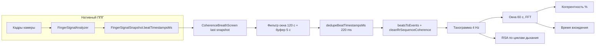

# Пайплайн «Когерентное дыхание»: от камеры до метрик и JSON-экспорта

Документ для **независимой проверки**: по нему можно сопоставить внешнее описание критериев (PDF со спецификацией практики и метрик) с реализацией в коде и с полями экспортируемого JSON. Исходные константы и формулы — в `modules/breath/core/coherence-constants.ts` и `modules/breath/core/coherence-session-analysis.ts`. Версия алгоритма в экспорте: `result.algorithmVersion` (см. `COHERENCE_ALGORITHM_VERSION`).

---

## 1. Вход: камера и нативный ППГ

1. Кадры с камеры (частота зависит от устройства) поступают в `**FingerSignalAnalyzer`** (`modules/biofeedback/core/finger-analysis.ts`).
2. После прогрева вызывается детектор пиков на отфильтрованном сигнале; метки пиков уточняются (`refinePeakTimestampMs`). Соседние кандидаты в пределах `**BEAT_DUPLICATE_TOLERANCE_MS` (220 мс)** сливаются в `**mergeBeatTimestampsPhase1`**.
3. История ударов ограничена `**BEAT_HISTORY_WINDOW_MS**` (45 мин) — старые метки отбрасываются с начала массива.
4. В каждом `**FingerSignalSnapshot**` наружу отдаётся `**beatTimestampsMs**`: это **актуальный merged-список** на момент кадра (не «нарастающий лог за сессию» снаружи анализатора).

**Шкала времени:** `snapshot.timestampMs` и элементы `beatTimestampsMs` в нативном режиме — **время представления кадра / CMTime-подобная шкала**, не Unix-epoch. Для практики когерентного дыхания после успешной проверки качества задаётся **logical start** `practicePpgAnchorMs` = конец 5-секундного окна QC (камера); окно `[anchor, anchor + 120 с]` — длительность практики (T=0). Для тахограммы и FFT в анализ передаются метки с `bufferMsBeforeSession` = 5 с до `anchor` (буфер QC).

---

## 2. Экран практики: что попадает в анализ

Файл: `modules/breath/ui/CoherenceBreathScreen.tsx`.

**Старт (только нативный ППГ):** 10 с прогрева (`COHERENCE_WARMUP_MS`) — без записи в `pulseLog`; затем цикл **5 с** (`COHERENCE_QUALITY_WINDOW_MS`) по времени камеры: `pulseLockState === tracking`, `signalQuality > 0.7`, не менее **3** ударов в окне (считаются по накопленному списку, см. A); при невыполнении окно сбрасывается. После успеха **logical T=0** = `anchor` = конец окна QC; `preflightBeatsRef` дублирует окно успешного QC для ясности.

| Шаг | Действие                                                                                         | Зачем                                                                                                                                                                                                                                                                                              |
| --- | ------------------------------------------------------------------------------------------------ | -------------------------------------------------------------------------------------------------------------------------------------------------------------------------------------------------------------------------------------------------------------------------------------------------- |
| A   | **`allSessionBeatsRef`**: на каждом кадре в фазах warmup / qualityCheck / running добавлять `snapshot.beatTimestampsMs` и вызывать `dedupeBeatTimestampsMs(..., COHERENCE_BEAT_DEDUPE_MS)` | В снимке merged-список ударов — **короткое скользящее окно** (порядка десятка меток), а не вся сессия. Без накопления в анализ попадали бы только последние пики, даже при стабильном `pulseLog`. Дедупликация по 220 мс схлопывает дрейф метки одного пика между кадрами; это не то же самое, что «сырой» `Set` по float без tolerance. |
| B   | По окончании 120 с: границы `**analysisStartMs` / `analysisEndMs`** (камера или Unix в симуляции) | Согласованы с `debug.sessionTimeBase`.                                                                                                                                                                                                                                                             |
| C   | `**beats` = фильтр** `allSessionBeatsRef` по `[T0 − buffer, T0 + 120 с]`                           | Полный ряд меток за практику (после дедупа), ограниченный окном анализа.                                                                                                                                                                                                                           |
| D   | Вызов `**runCoherenceSessionAnalysis({ beatTimestampsMs: beats, …, bufferMsBeforeSession })`**          | Единая точка расчёта метрик и структуры `result`.                                                                                                                                                                                                                                                  |

Промежуточные контрольные точки для отладки собираются в `**debug**` (см. раздел 5) и дублируются числом ударов на экране результатов.

---

## 3. Анализ сессии (соответствие PDF)

Файл: `modules/breath/core/coherence-session-analysis.ts`. Ниже — порядок, сопоставимый с пунктами спецификации из PDF (окно, шаг, спектр, Pwin/Ptotal, пороги, RSA, время вхождения); численные значения — в `**coherence-constants.ts**`.

1. **Фильтр окна сессии**
  `beatsInSession` = все метки в `[sessionStartedAtMs - bufferMsBeforeSession, sessionEndedAtMs]` (с небольшим допуском ±1 мс); `bufferMsBeforeSession` = `COHERENCE_PREFLIGHT_BUFFER_MS` (5 с) для буфера QC.
2. **Дедупликация**
  `**dedupeBeatTimestampsMs(beatsInSession, COHERENCE_BEAT_DEDUPE_MS)`** (220 мс) — согласовано с логикой merge в finger-analysis; на «чистом» merged-снимке обычно идемпотентно, страхует от артефактов.
3. **RR и очистка (пранаяма)**
  - Пары соседних меток → `**beatsToEvents`** → последовательность RR.  
  - `**cleanRrSequenceCoherence**` (`modules/breath/core/tachogram-4hz.ts`): те же критерии отклонения **30 %** от локальной медианы, замена артефакта на **средний RR по «хорошим» интервалам**; RMSSD/стресс в `FingerSignalAnalyzer` по-прежнему используют `**cleanRrSequence**`. Предупреждение о доле артефактов — только если `**rrBadFraction ≥ RR_COHERENCE_WARN_FRACTION` (15%)**.
4. **Тахограмма 4 Гц**
  `**buildTachogramBpmSeries`** с `**TACHO_SAMPLE_RATE_HZ = 4**`: равномерная сетка по времени, BPM из очищенных RR.
5. **Режим `test120s`** (экран теста 120 с)
  - Окно для спектра: `**TEST120_WINDOW_SECONDS` (60 с)**, без пропуска начала: `**TEST120_WINDOW_SKIP_SECONDS` (0)**.
6. **Покомпонентно по секундам** `s = 1 … floor(practiceDurationSec)` (от `logical start`, без буфера)
  - Окно: `[wallClockMs - windowSeconds, wallClockMs]`.  
  - FFT (размер до ближайшей степени двойки), мощность:  
    - `**Ptotal`**: сумма `|X|^2` по бинам с **f** в `[PTOTAL_MIN_HZ … PTOTAL_MAX_HZ]` (0,04–0,4 Гц); `**Pwin`**: сумма по тем же бинам, что попадают в узкое окно ±`PWIN_HALF_WIDTH_HZ` вокруг пика дыхания, **обрезанное** до того же `[PTOTAL_MIN … PTOTAL_MAX]` (чтобы часть не превышала целое). `**coherenceRatio = min(1, pwin/ptotal)`**.  
    - `**Pwin**`: узкий пик в `**PWIN_SEARCH_MIN_HZ` … `PWIN_SEARCH_MAX_HZ**` ± `**PWIN_HALF_WIDTH_HZ**`.
  - `**coherenceRatio = Pwin / Ptotal**`, затем `**mapCoherenceRatioToPercent**` с `**COHERENCE_MASTER_RATIO**` и `**COHERENCE_STRETCH_EXPONENT**`.
7. **Сглаживание ряда когерентности**
  `**SMOOTH_WINDOW_SECONDS` (3 с)**: **медианный фильтр** по окну 3 с при частоте 1 выборка/с (п. 8 ТЗ).
8. **Агрегаты**
  Среднее и макс. по секундам **после** `skipAggregateSec` (для `test120s` — 0).
9. **RSA**
  Циклы дыхания `**inhaleMs + exhaleMs`**: на каждом цикле по полному тахограммному ряду за сессию берётся срез BPM; `**rsaBpm = hrMax - hrMin**`; цикл **неактивен**, если `**rsaBpm < RSA_CYCLE_MIN_BPM` (2)**. Итоговая **амплитуда RSA** — **медиана** по активным циклам.
10. **Нормированная RSA**
  `(медианная амплитуда RSA в уд/мин) / (средний мгновенный пульс по ряду тахограммы 4 Гц за практику) × 100 %`. Средний пульс — **среднее арифметическое** `fullTacho.bpm` на `[T0, T0+длительность]`; в числителе — та же **амплитуда RSA**, что и в показателе «Амплитуда RSA» (медиана по активным дыхательным циклам), а не глобальный max−min по всем точкам 4 Гц (иначе размах завышается артефактами интерполяции).
11. **Время вхождения**
  После медианного сглаживания ищется первая секунда, с которой начинается **непрерывное** `ENTRY_STABILITY_SECONDS` (15 с) уровня ≥ `**COHERENCE_ENTRY_THRESHOLD_PERCENT`** (40%). Счётчик секунд только после **logical start** (T=0).

---

## 4. Поток данных (схема)

---

## 5. Структура JSON-экспорта (`schemaVersion: 2`)

Формируется в `**buildCoherenceExportJson**`. Эксперт может проверить цепочку: **входные метки → после окна → после дедупликации → `result`**.

| Поле верхнего уровня | Содержание                                                                                                                                                                                                                                        |
| -------------------- | ------------------------------------------------------------------------------------------------------------------------------------------------------------------------------------------------------------------------------------------------- |
| `schemaVersion`      | `2`: в `beats` разделены `**timestampsMsWindowFiltered**` и `**timestampsMsAnalyzed**`.                                                                                                                                                           |
| `exportedAtMs`       | Время выгрузки файла (Unix).                                                                                                                                                                                                                      |
| `algorithmVersion`   | Дублируется в `result.algorithmVersion`.                                                                                                                                                                                                          |
| `dataSource`         | `fingerPpg` | `simulated`.                                                                                                                                                                                                                        |
| `debug`              | Снимок UI/сессии: шкала времени, якорь, wall-clock старта, счётчики колбэков, последний снимок, **длины массивов** до/после фильтра окна, после дедупликации (см. тип `CoherenceExportDebug`).                                                    |
| `pulseLog`           | Редкий лог (~2 Гц wall-clock): `cameraTimestampMs`, `pulseRateBpm`, качество, `pulseLockState`, `**beatTimestampsCount`** в снимке — для сопоставления с длиной merged-массива, не подменяет собой список ударов.                                 |
| `session`            | `startedAtMs`, `endedAtMs`, `inhaleMs`, `exhaleMs`, `mode`, `bufferMsBeforeSession`, `**beatCountWindowFiltered**`, `**beatCountAnalyzed**`.                                                                                                      |
| `beats`              | `**timestampsMsWindowFiltered**`: метки в окне сессии до дедупликации; `**timestampsMsAnalyzed**`: те же данные после `**dedupeBeatTimestampsMs**` — именно они идут в RR и тахограмму.                                                           |
| `result`             | Полный `**CoherenceSessionResult**`: предупреждения, `perSecond`, `perSecondSmoothed`, `rsaCycles`, `**exportMeta**` (см. п. 5.1).                                                                                                                   |

**Проверка для эксперта:** вручную отфильтровать `timestampsMsWindowFiltered` тем же окном → применить описанную дедупликацию → должно совпасть с `timestampsMsAnalyzed` и с длинами в `result.exportMeta`. Далее по разделу 3 воспроизводятся `rrBadFraction`, спектральные величины по секундам и RSA.

### 5.1. Поля `result.exportMeta` (диагностика качества)

| Поле | Смысл |
| --- | --- |
| `beatsAfterWindowFilter`, `beatsAfterDedupe`, `beatDedupeToleranceMs` | Сколько меток прошло фильтр и дедупликацию. |
| `bufferMsBeforeSession` | Буфер QC перед T=0 (мс). |
| `practiceBeatCount`, `practiceBeatSpanMs` | Число ударов **только в окне практики** `[T0, T0+120 с]` и размах времени (max−min) между ними. Если `practiceBeatSpanMs` много меньше 120 000 при ожидаемом равномерном ритме, удары сгруппированы во времени (частый случай — в конце сессии остались только недавние пики в merged-буфере анализатора). |
| `coherenceEntryThresholdPercent`, `entryStabilitySeconds` | Порог когерентности для «вхождения» и требуемая длина серии (секунд подряд). |
| `rrBadFraction`, `rrCoherenceWarnFraction` | Доля заменённых RR и порог предупреждения. |
| `smoothWindowSeconds` | Ширина медианного фильтра по ряду когерентности (сек). |
| `rsaNormalizedPercent` | Нормированная RSA, если посчитана. |
| `maxConsecutiveSecondsAtOrAboveEntryThreshold` | Максимум **подряд** секунд (после медианного сглаживания), на которых когерентность ≥ `coherenceEntryThresholdPercent`. Если `entryTimeSec` в `result` равен `null`, это число &lt; `entryStabilitySeconds` — условие «вхождения» не выполнено. |

### 5.2. Почему `entryTimeSec` может быть `null` при «нормальных» остальных метриках

Критерий **строгий**: на ряду `result.perSecondSmoothed` (медианный фильтр 3 с исходного `perSecond`) должна найтись **первая** секунда, с которой начинается **непрерывный** отрезок длины `entryStabilitySeconds` (15 с), где на каждой секунде `coherenceMappedPercent ≥ COHERENCE_ENTRY_THRESHOLD_PERCENT` (40 %).

Типичные причины `null`:

1. **Нет 15 с подряд ≥ 40 %** — даже если `coherenceMaxPercent` ≈ 42 %, пик может быть коротким (2–4 с), серия обрывается → `maxConsecutiveSecondsAtOrAboveEntryThreshold` в `exportMeta` будет маленьким.
2. **Мало ударов / узкий размах по времени** — при малых `practiceBeatCount` или малом `practiceBeatSpanMs` скользящее окно FFT (60 с) долго не набирает достаточно точек тахограммы; в `perSecond`/`perSecondSmoothed` длинные участки с **0** (нет данных для FFT). Тогда «вхождение» по порогу не наступает.
3. **Средняя когерентность низкая** и пики единичные — среднее и макс. по секундам могут быть ненулевыми, но условие 15 с подряд не выполняется.

В приложении в `result.warnings` добавляется поясняющая строка, если вхождение не найдено, с числом «максимум подряд» секунд.

### 5.3. Что проверить в JSON на «подозрительность» (пример разбора)

1. **`debug.rawBeatMinMs` / `rawBeatMaxMs`** (или `beats.timestampsMs*`) — размах меток ударов внутри окна анализа. Для 120 с практики при стабильном контакте и **полном накоплении** `allSessionBeatsRef` ожидается размах порядка **~120 с** между крайними метками в окне практики. Если размах сильно меньше длительности при том, что `pulseLog` показывает стабильное качество всю сессию, имеет смысл проверить версию приложения / экспорт (до исправления 1.1.2 в анализ мог попадать только последний скользящий буфер снимка).
2. **`result.perSecond[].tachogramSampleCount`** — если на большинстве секунд &lt; 8, FFT не выполняется (`coherenceMappedPercent` = 0).
3. **`result.perSecondSmoothed`** — поиск самой длинной серии подряд с `coherenceMappedPercent ≥ 40` вручную должен совпасть с `exportMeta.maxConsecutiveSecondsAtOrAboveEntryThreshold`.
4. **`pulseLog.beatTimestampsCount`** — длина merged-массива на снимке; не путать с числом ударов за всю практику (оно в `beats` / `exportMeta`).

---

## 6. Соответствие PDF и коду

| Тема в PDF                                       | Где в коде                                                     |
| ------------------------------------------------ | -------------------------------------------------------------- |
| Частота дискретизации тахограммы                 | `TACHO_SAMPLE_RATE_HZ`                                         |
| Окно / пропуск для агрегатов (prod vs тест 120 с) | `PRODUCTION_*`, `TEST120_*`, `mode`                             |
| Порог артефактов RR 30 %                         | `RR_ARTIFACT_DEVIATION`                                        |
| Диапазоны Pwin / Ptotal                          | `PWIN_*`, `PTOTAL_*`                                           |
| Порог «вхождения» и устойчивость                 | `COHERENCE_ENTRY_THRESHOLD_PERCENT`, `ENTRY_STABILITY_SECONDS` |
| RSA: неактивный цикл                             | `RSA_CYCLE_MIN_BPM`                                            |
| Нормированная RSA (PDF)                          | `result.rsaNormalizedPercent`, `rsaAmplitudeBpm / mean(fullTacho.bpm) × 100` |

Если в PDF указаны иные числа, расхождение видно по этой таблице и по `result.exportMeta` / `coherence-constants.ts`.

---

## 7. Известные ограничения

- `**pulseLog`** не содержит полного списка `beatTimestampsMs` на каждом шаге — только счётчик; полные массивы — в `**beats**` и в конечном `**result**`.
- Симуляция RR (Expo Go / отладка) обходит нативный ППГ; в JSON указано `dataSource: "simulated"`.
- Время вхождения зависит только от **сглаженного** ряда и **15 с подряд** ≥ порога; см. п. 5.2. Оно **не** выводится из средней/макс. когерентности за сессию.

