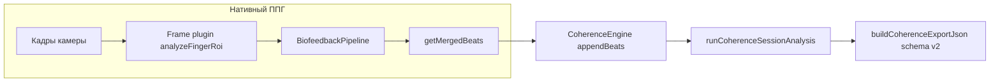

# Пайплайн «Когерентное дыхание»: от камеры до метрик и JSON-экспорта

Документ для **независимой проверки**: по нему можно сопоставить внешнее описание критериев (PDF со спецификацией практики и метрик) с реализацией в коде и с полями экспортируемого JSON. Исходные константы и формулы — в `modules/breath/core/coherence-constants.ts` и `modules/breath/core/coherence-session-analysis.ts`. Версия алгоритма когерентности в экспорте: `result` / `algorithmVersion` (см. `COHERENCE_ALGORITHM_VERSION`).

**Архитектура (актуально):** нативный ППГ идёт через `**BiofeedbackPipeline`** (`modules/biofeedback/bus/biofeedback-pipeline.ts`), а не через удалённый `FingerSignalAnalyzer`. Камера: `**FingerPpgCameraSource`** → сырые сэмплы в pipeline → **BiofeedbackBus** (каналы `optical`, `contact`, `pulseBpm`, `session`, …). Экран `**CoherenceBreathScreen`** подписан на шину через `**useBiofeedbackSnapshot`** и каналы; накопление ударов для сессии когерентности — в `**CoherenceEngine`** (`appendBeats` из merged-ряда pipeline). Полный обзор слоёв: `docs/biofeedback-architecture.md`.

---

## 1. Вход: камера и нативный ППГ

1. Кадры с задней камеры (частота зависит от устройства) обрабатываются плагином кадра (`analyzeFingerRoi` в `modules/biofeedback-finger-frame-processor`) → `**RawOpticalSample**` в `**BiofeedbackPipeline.pushOpticalSample**`.
2. **Оптика:** `OpticalRingBuffer` — детренд, оценка FPS, качество сигнала для детекции (`opt.signalQuality` внутри pipeline).
3. **Контакт:** `ContactMonitor` — состояние `absent | weak | present` и **уверенность присутствия пальца** `confidence` (0…1), публикуется в канал `**contact`**.
4. **Калибровка (внутри pipeline):** `CalibrationStateMachine`: `idle → contactSearch → warmup (10 с) → settle (10 с, нужна доля «хороших» тиков) → ready → lost`. Параметры: `WARMING_PHASE_MS`, `PULSE_SETTLE_MS`, `PULSE_SETTLE_GOOD_FRAC` в `modules/biofeedback/constants.ts`. Пока фаза `**warmup`** или раньше — **пик-детекция по ППГ не выполняется** (нет новых merged-ударов из оптики).
5. После выхода из прогрева pipeline — **детектор пиков** на полосовом сигнале, `**mergeBeatTimestampsPhase1`**, история ограничена константами слоя SIGNAL (`BEAT_HISTORY_WINDOW_MS`, `BEAT_DUPLICATE_TOLERANCE_MS` — см. `modules/biofeedback/constants.ts`).
6. **Merged-удары** — актуальный список на каждом кадре: `**BiofeedbackPipeline.getMergedBeats()`** (не полный лог «всей жизни» приложения, а скользящее окно).

**Шкала времени:** метки ударов и `timestampMs` сэмплов в нативном режиме — **время представления кадра / CMTime-подобная шкала**, не Unix-epoch. Для практики после успешного **экранного** QC задаётся **logical start** `practicePpgAnchorMs` = конец 5-секундного окна QC по времени камеры; окно `[anchor, anchor + 120 с]` — длительность практики (T=0). Для тахограммы и FFT в анализ передаются метки с `bufferMsBeforeSession` = 5 с до `anchor` (буфер QC / preflight).

---

## 2. Экран практики: маршрут и что попадает в анализ

Файл: `modules/breath/ui/CoherenceBreathScreen.tsx`.

### 2.1. Фазы UI (маршрут)

| Фаза UI        | Условие перехода  | Что происходит                                                                                                                                                                                                   |
| -------------- | ----------------- | ---------------------------------------------------------------------------------------------------------------------------------------------------------------------------------------------------------------- |
| `idle`         | Старт             | Пользователь нажимает «Начать»: `pipeline.softReset()`, сброс `CoherenceEngine`.                                                                                                                                 |
| `warmup`       | Из `idle`         | **10 с по системным часам** (`COHERENCE_WARMUP_MS`), без записи в `pulseLog`. Параллельно pipeline проходит свою калибровку (см. §1); пики из камеры в первые ~10 с по времени **pipeline** могут отсутствовать. |
| `qualityCheck` | После 10 с warmup | Окно **5 с по времени камеры** (`COHERENCE_QUALITY_WINDOW_MS`): на **конце** окна проверяются критерии (см. §2.2). При провале якорь окна сдвигается (`qcStartLogicalMsRef = camTs`).                            |
| `running`      | Успешный QC       | `CoherenceEngine.startSession({ sessionStartedAtMs: anchor, preflightBeats, bufferMsBeforeSession: 5 с, … })`, далее каждые ~250 мс `appendBeats(pipeline.getMergedBeats())`.                                    |
| `results`      | 120 с практики    | `finalize`, экспорт JSON.                                                                                                                                                                                        |

Таймер **«Окно 5 с — осталось N с»** на экране считается по **той же** разнице `camTs − qcStart`, что и логика QC (не только декоративный текст).

### 2.2. Критерии прохождения QC (экран `qualityCheck`)

Оценка в **конце** 5-секундного интервала `[qcStart, qcStart + 5000]` по **времени камеры**:

| Критерий                        | Откуда в коде                                            | Правильный замер                                                                                                                                                                                                           |
| ------------------------------- | -------------------------------------------------------- | -------------------------------------------------------------------------------------------------------------------------------------------------------------------------------------------------------------------------- |
| `pulseLockState === "tracking"` | Канал `pulseBpm` / снимок                                | Pipeline считает lock **tracking**, если контакт **present**, качество достаточно для трека (`SignalQualityMonitor`), есть свежий удар, BPM в допустимом диапазоне, ритм «согласованный» (`PulseBpmEngine.looksCoherent`). |
| «Качество» > 70 %               | `**useBiofeedbackSnapshot().signalQuality`**             | В адаптере это `**contact.confidence`** — **уверенность контакта пальца** (`ContactMonitor`), не отдельное поле «SNR ППГ» в UI. Критерий: **> 0.7**.                                                                       |
| ≥ 3 удара в окне                | `getMergedBeats()` отфильтрованные в `[qcStart, winEnd]` | Merged-метки после детекции (после выхода pipeline из ранней фазы warmup).                                                                                                                                                 |

Если все три выполнены — `anchor = qcStart + 5000`, старт сессии когерентности.

### 2.3. Накопление ударов для отчёта (вместо старого `allSessionBeatsRef`)

| Шаг | Действие                                                                                                                                                                                     | Зачем                                                                                                                                   |
| --- | -------------------------------------------------------------------------------------------------------------------------------------------------------------------------------------------- | --------------------------------------------------------------------------------------------------------------------------------------- |
| A   | Во время `**running`** вызывается `**CoherenceEngine.appendBeats(merged)`** с полным merged-списком из pipeline; внутри engine — `**dedupeBeatTimestampsMs(..., COHERENCE_BEAT_DEDUPE_MS)`** | Единый дедуп нарастающего ряда за сессию + preflight из QC.                                                                             |
| B   | По окончании 120 с: `**analysisStartMs` / `analysisEndMs**` по камере                                                                                                                        | Согласованы с `debug.sessionTimeBase` и `practicePpgAnchorMs`.                                                                          |
| C   | `**runCoherenceSessionAnalysis**`                                                                                                                                                            | Фильтр окна сессии + буфер, RR, тахограмма 4 Гц, FFT, RSA, вхождение — без дублирования математики вне `coherence-session-analysis.ts`. |

Промежуточные контрольные точки для отладки — в `**debug**` экспорта и в `**exportMeta**` (см. §5).

---

## 3. Промежуточные точки алгоритма (контрольный лист)

| Точка                     | Что измеряется                                                       | Критерий «измерение корректно»                                                                                                                                                                                                             |
| ------------------------- | -------------------------------------------------------------------- | ------------------------------------------------------------------------------------------------------------------------------------------------------------------------------------------------------------------------------------------ |
| Сырой кадр                | ROI пальца, средние RGB / luma                                       | Сэмплы идут с растущим `timestampMs` (камера); при `camTs <= 0` QC/таймер не стартуют.                                                                                                                                                     |
| Контакт                   | `fingerPresenceConfidence` → `contact.state`, `confidence`           | Приложенный палец: `present`, confidence обычно растёт; для QC UI нужно **> 0.7** (как proxy «качества» в подписи экрана).                                                                                                                 |
| Фаза калибровки pipeline  | `session.phase` на шине                                              | После **warmup** появляются merged-удары; до этого пиков из оптики нет — **норма**.                                                                                                                                                        |
| Merged-удары              | Список меток пиков                                                   | Монотонность, шаг RR в разумных пределах; в JSON — размах `rawBeatMinMs`…`rawBeatMaxMs` покрывает сессию + буфер.                                                                                                                          |
| Lock пульса               | `pulseLockState`                                                     | Для QC нужен `**tracking`** (не только `holding`).                                                                                                                                                                                         |
| Окно QC 5 с               | Границы по `camTs`                                                   | После прохождения — `**practicePpgAnchorMs`** = конец окна; `analysisSessionEndMs − analysisSessionStartMs` ≈ **120000** мс.                                                                                                               |
| RR / пранаяма             | Очистка `cleanRrSequenceCoherence`                                   | `rrBadFraction` в `exportMeta` низкая (< порога предупреждения 15 % при стабильном контакте).                                                                                                                                              |
| Когерентность по секундам | FFT 60 с, `pwin/ptotal`                                              | Для «валидной» секунды нужно `coverageFraction ≥ COHERENCE_WINDOW_MIN_COVERAGE_FRAC` (0.85). Типично первые ~48 секунд практики `insufficientCoverage: true` → `coherenceMappedPercent = 0`. Это корректное поведение, а не «нет дыхания». |
| Время вхождения           | 15 с подряд ≥ 40 % на **сглаженном** ряду (после медиан-фильтра 3 с) | `entryTimeSec` не `null`; `maxConsecutiveSecondsAtOrAboveEntryThreshold` ≥ 15. Секунды `insufficientCoverage` обнуляют счётчик.                                                                                                            |
| Live-метрики на экране    | Гармония / RSA / RMSSD / стресс / время вхождения / время практики   | В «opticalMetrics» подпись — актуальный снимок; если «Гармония» стабильно **падает** по мере практики, значит тахограмма содержит фантомные значения в окне FFT (сигнал об ошибке — раньше была регрессия экстраполяции).                  |

Математика спектра, пороги Pwin/Ptotal, RSA, вхождение — по-прежнему в `**coherence-session-analysis.ts`** (соответствие PDF — §4 ниже).

---

## 4. Анализ сессии (соответствие PDF)

Файл: `modules/breath/core/coherence-session-analysis.ts`. Численные значения — в `**coherence-constants.ts`**.

1. **Фильтр окна сессии** — метки в `[sessionStartedAtMs - bufferMsBeforeSession, sessionEndedAtMs]`; `bufferMsBeforeSession` = `COHERENCE_PREFLIGHT_BUFFER_MS` (5 с).
2. **Дедупликация** — `dedupeBeatTimestampsMs(..., COHERENCE_BEAT_DEDUPE_MS)` (220 мс).
3. **RR и очистка (пранаяма)** — `cleanRrSequenceCoherence` в `tachogram-4hz.ts`; предупреждение при доле артефактов ≥ `RR_COHERENCE_WARN_FRACTION` (15 %).
4. **Тахограмма 4 Гц** — `TACHO_SAMPLE_RATE_HZ = 4`. **Строго интерполяция, без экстраполяции** (`buildTachogramBpmSeries`): значения за пределами диапазона `[firstBeatMid, lastBeatMid]` не генерируются. Это блокирует фантомные отрицательные BPM в «пустой» левой части 60-с окна FFT в первые ~48 с практики (иначе получалась искусственно высокая «когерентность» 80–100 %).
5. **Режим `test120s`** — окно спектра `TEST120_WINDOW_SECONDS` (60 с), `TEST120_WINDOW_SKIP_SECONDS` = **60** (PDF п. 8 «не включай первые 60 с в итоговый расчёт среднего и макс. когерентности»). В 120-с тесте агрегаты считаются по секундам 61…120.
6. **Покомпонентно по секундам** — Pwin/Ptotal в диапазонах `PTOTAL_*`, `PWIN_*`, `mapCoherenceRatioToPercent`. На каждой секунде проверяется **покрытие 60-с окна**: если реальных тахограмм-точек меньше `COHERENCE_WINDOW_MIN_COVERAGE_FRAC × 240` (по умолчанию 85 % → 204 точки из 240), секунда помечается `insufficientCoverage: true`, `**coherenceMappedPercent = 0`** и **не участвует во времени вхождения**.
7. **Сглаживание** — `SMOOTH_WINDOW_SECONDS` (3 с), медианный фильтр (PDF п. 8).
8. **Агрегаты** — среднее/макс. по секундам после skip и **по секундам без `insufficientCoverage`**.
9. **RSA** — по дыхательным циклам; цикл учитывается, только если тахограмма покрывает его на ≥ 80 %; неактивный при `rsaBpm < RSA_CYCLE_MIN_BPM`. Итоговая **медиана** по активным циклам.
10. **Нормированная RSA** — `rsaAmplitudeBpm / mean(fullTacho.bpm) × 100 %`.
11. **Время вхождения** — `ENTRY_STABILITY_SECONDS` (15 с) при `COHERENCE_ENTRY_THRESHOLD_PERCENT` (40 %). Считается от начала практики (**t = 0**) по сглаженному ряду; секунды с `insufficientCoverage` обнуляют streak. `entryTimeSec` = секунда **первого удара серии из 15 подряд** ≥ 40 %.

---

## 5. Поток данных (схема)

---

## 6. Структура JSON-экспорта (`schemaVersion: 2`)

Формируется через `**CoherenceEngine.buildExportJson**` → `**buildCoherenceExportJson**` в `coherence-session-analysis.ts`. Детальный полный след событий шины и движков — в отдельном экспорте **v3** (`modules/biofeedback/export/SessionExporter.ts`), если включён в пробе.

| Поле верхнего уровня           | Содержание                                                                                                                                                                                    |
| ------------------------------ | --------------------------------------------------------------------------------------------------------------------------------------------------------------------------------------------- |
| `schemaVersion`                | `2`: в `beats` — `timestampsMsWindowFiltered` и `timestampsMsAnalyzed`.                                                                                                                       |
| `exportedAtMs`                 | Время выгрузки файла (Unix).                                                                                                                                                                  |
| `algorithmVersion`             | Версия когерентностного анализа.                                                                                                                                                              |
| `dataSource`                   | `fingerPpg`                                                                                                                                                                                   |
| `debug`                        | Якорь, wall-clock старта, счётчики колбэков, длины массивов до/после фильтра окна и дедупа (`CoherenceExportDebug`).                                                                          |
| `pulseLog`                     | Редкий лог (~2 Гц wall-clock): пульс, **signalQuality в логе** (как на момент снимка), `pulseLockState`, `beatTimestampsCount` — **длина merged в pipeline**, не число ударов «за всю жизнь». |
| `session` / `beats` / `result` | Как раньше: окно, дедуп, `CoherenceSessionResult`, `exportMeta`.                                                                                                                              |

### 6.1. Поля `result.exportMeta` (диагностика качества)

| Поле                                                                  | Смысл                                                                                                                                                                            |
| --------------------------------------------------------------------- | -------------------------------------------------------------------------------------------------------------------------------------------------------------------------------- |
| `beatsAfterWindowFilter`, `beatsAfterDedupe`, `beatDedupeToleranceMs` | Сколько меток прошло фильтр и дедупликацию.                                                                                                                                      |
| `bufferMsBeforeSession`                                               | Буфер QC перед T=0 (мс).                                                                                                                                                         |
| `practiceBeatCount`, `practiceBeatSpanMs`                             | Удары только в окне практики `[T0, T0+120 с]` и размах времени между крайними метками. Ожидается `practiceBeatSpanMs` порядка **~115–120 с** при стабильном ритме ~60–90 уд/мин. |
| `rrBadFraction`, `rrCoherenceWarnFraction`                            | Доля заменённых RR и порог предупреждения.                                                                                                                                       |
| `maxConsecutiveSecondsAtOrAboveEntryThreshold`                        | Максимум подряд секунд (на сглаженном ряду) с когерентностью ≥ порога вхождения.                                                                                                 |

### 6.2. Почему `entryTimeSec` может быть `null`

См. прежнюю логику: нужна **непрерывная** серия **15 с** ≥ **40 %** на `**perSecondSmoothed`**. Типичные причины `null` — короткие пики когерентности, мало точек тахограммы в окне FFT, длинные нули в `perSecond`.

### 6.3. Что проверить в JSON на «подозрительность»

1. `**debug.rawBeatMinMs` / `rawBeatMaxMs`** — размах ~ буфер + 120 с + хвост merged.
2. `**analysisSessionEndMs - analysisSessionStartMs`** ≈ **120000** мс.
3. `**result.perSecond[].bpmMean`** — всегда положительный. Отрицательный `bpmMean` = баг экстраполяции в тахограмме (регрессия должна быть закрыта, §4 п. 4).
4. `**result.perSecond[].insufficientCoverage`** — `true` только на ранних секундах (до ~48 с практики), пока 60-с окно FFT не заполнилось реальными точками; соответствующие `coherenceMappedPercent = 0`.
5. `**result.perSecond[].coherenceMappedPercent**` — монотонно растёт (с флуктуациями) по мере входа в состояние когерентности. Если график **стабильно падает со 100 % до 40 %** в начале практики — это сигнал об ошибке тахограммы.
6. `**exportMeta.secondsWithInsufficientCoverage`** — обычно **40–50** в 120-с тесте (ширина пустой зоны в начале).
7. `**exportMeta.secondsCountedInAggregate`** — обычно **60** (секунды 61…120 после `skipAggregateSec = 60`).
8. `**result.perSecond[].tachogramSampleCount`** — 204+ на большинстве секунд после 48 с практики; нули только на проблемных участках сигнала.
9. `**pulseLog.beatTimestampsCount`** — скользящая длина merged, не «всего ударов за 120 с».

---

## 7. Соответствие PDF и коду

| Тема в PDF              | Где в коде                                                           |
| ----------------------- | -------------------------------------------------------------------- |
| Частота тахограммы      | `TACHO_SAMPLE_RATE_HZ`                                               |
| Окна test120s           | `TEST120_*`, `mode`                                                  |
| Порог артефактов RR     | `RR_ARTIFACT_DEVIATION`, предупреждение `RR_COHERENCE_WARN_FRACTION` |
| Диапазоны Pwin / Ptotal | `PWIN_*`, `PTOTAL_*`                                                 |
| Порог вхождения         | `COHERENCE_ENTRY_THRESHOLD_PERCENT`, `ENTRY_STABILITY_SECONDS`       |
| RSA                     | `RSA_CYCLE_MIN_BPM`, `rsaNormalizedPercent`                          |

---

## 8. Известные ограничения

- `**pulseLog`** не содержит полного списка ударов — только счётчик и метрики снимка; полные массивы — в `**beats**` и производных в `**result**`.
- В UI подпись «кач. X %» на экранах калибровки берётся из **уверенности контакта** (`contact.confidence` в адаптере), а не из отдельного поля «SNR оптики» — см. §2.2.
- Симуляция RR обходит нативный ППГ; в JSON `dataSource: "simulated"`.
- Расширенный отладочный экспорт с шиной — `**schemaVersion: 3`** (модуль biofeedback), не путать с `**schemaVersion: 2`** отчёта когерентного дыхания.

---

## 9. Контрольный чеклист по одному экспорту (ручная валидация)

1. **Длительность:** `analysisSessionEndMs - analysisSessionStartMs` = **120000** ± допуск на последний удар.
2. **Покрытие ударами:** `practiceBeatSpanMs` ≈ **115–120 с**; `practiceBeatCount` согласован с средним ЧСС (~120 с × BPM/60).
3. **Очистка RR:** `rrBadFraction` < **0.15** при хорошем контакте.
4. **Вхождение:** если `entryTimeSec` число — на `perSecondSmoothed` видна серия ≥ **15** с подряд ≥ **40 %**; `maxConsecutiveSecondsAtOrAboveEntryThreshold` согласован.
5. **Согласованность массивов:** длина `beats.timestampsMsAnalyzed` = `beatsAfterDedupe` в `exportMeta` (при том же окне фильтра).

При выполнении пунктов можно считать, что **цепочка от merged-ударов до метрик** отработала согласованно; отдельно оценивают **биомеханику** (стабильность пальца, редкие `holding` в `pulseLog`).

---

## 10. Регрессии и их исправления

### 10.1. Фантомная высокая когерентность в первые ~50 с (закрыто в `1.1.6`)

**Симптом на экране:** «Гармония» показывает **~100 %** на старте практики и **падает** до 40–70 % к середине. Пользователь ожидает противоположного движения.

**Симптом в JSON:** `result.perSecond[0..~50].bpmMean` — **отрицательный** (например, `-190`); `coherenceMappedPercent` в первых секундах 85–100 %, `entryTimeSec = 1`.

**Корневая причина:** `buildTachogramBpmSeries` линейно интерполировала значения BPM по сетке 4 Гц для всего окна `[windowStartMs, windowEndMs]`, **включая** область до первого реального удара. Когда 60-с FFT-окно только открывается (секунды 1..48), реальных точек в его левой половине нет, но интерполятор всё равно «дорисовывал» их **экстраполяцией** — получались абсурдные отрицательные BPM, линейно растущие от края к центру. FFT ловит этот **искусственный низкочастотный тренд** → огромный Pwin/Ptotal → `coherenceRatio` → 60–100 %.

**Как исправлено:** `buildTachogramBpmSeries` больше **не генерирует** точки за пределами `[firstBeatMid, lastBeatMid]`. Для «недозаполненных» FFT-окон на секунде s вводится флаг `insufficientCoverage: true`, и `coherenceMappedPercent = 0` (не учитывается в агрегатах/во времени вхождения). `TEST120_WINDOW_SKIP_SECONDS` поднят с 0 до 60 по PDF п. 8.

**Ожидаемое корректное поведение после фикса:**

- В JSON: `perSecond[0..~48].insufficientCoverage: true`, `coherenceMappedPercent: 0`; далее рост; `entryTimeSec` обычно в диапазоне 50..120 с для новичка, или `null`.
- На экране: «Гармония» растёт с 0 % ближе к ~60-й секунде, а не падает со 100 %.
- Entry time **не может быть меньше 49**, потому что до этого FFT-окно физически не заполнено.

### 10.2. Завышенный Pwin/Ptotal из-за узкого диапазона Ptotal (закрыто в `1.1.7`)

**Симптом на экране:** стабильно высокая когерентность **≥ 75 %** и максимум **≥ 95 %** у практически любого пользователя (не соответствует пользовательской шкале «< 15 % слабо / 15–40 % норма / 40–75 % хорошо / > 75 % отлично»).

**Корневая причина:** в `coherence-constants.ts` `PTOTAL_MIN_HZ` был **0.04 Гц** (LF+HF диапазон), а по PDF § 5 Ptotal — это классический **TotalPower HRV**: сумма мощности от **0.0033 Гц** до 0.4 Гц (VLF+LF+HF). За счёт исключения VLF-бинов знаменатель был систематически занижен, а отношение Pwin/Ptotal — завышено; после `mapCoherenceRatioToPercent` это превращалось в стабильные 70–100 %.

**Как исправлено:** `PTOTAL_MIN_HZ = 0.0033` (как в PDF). На 60-с FFT-окне фактическая минимальная представимая частота ≈ 1/60 ≈ 0.0167 Гц; новая константа означает «суммировать все низкочастотные бины начиная от первого после DC», что математически корректно.

**Ожидаемое корректное поведение после фикса:**

- У обычного человека в покое `coherenceAveragePercent` обычно ниже **~15–30 %**.
- В практике когерентного дыхания у тренированного пользователя — чаще **~20–55 %**.
- Значения **> 75 %** — редкие, соответствуют почти «учебной» синусоиде RSA при дыхании ~6/мин.
- Начиная с `algorithmVersion = 1.1.9`, UI-маппинг процентов откалиброван под пользовательскую шкалу:
  `coherenceMasterRatio = 0.75`, `coherenceStretchExponent = 1.25`. Сырые спектральные
  `pwin`, `ptotal`, `coherenceRatio` при этом не меняются — меняется только визуальная шкала `%`.

### 10.3. Про «время вхождения» ≈ длительности FFT-окна

Пока длина FFT-окна фиксирована в 60 с, первые ~48 секунд практики помечаются `insufficientCoverage` (см. §10.1). Как следствие, минимально достижимое `entryTimeSec` ≈ **49 с** даже для идеального дыхания. Это **физический предел метода FFT**, а не ошибка. В будущих версиях можно добавить **adaptive window** (начинать с 30-с окна и растить до 60 с по мере накопления данных) — это даст `entryTimeSec` от ~34 с при сохранении корректности поздних агрегатов. Пока — **не меняем**, чтобы не ломать сопоставимость с PDF и историческими сессиями.

### 10.4. На будущее: внешние библиотеки

Для дальнейших итераций имеет смысл рассмотреть замену ядра на проверенные реализации: **HeartPy** (Python, ревью-cited), **SciPy signal** (FFT/фильтры), **pyVHR** (PPG/rPPG). Для React Native это работает как офлайн-обработка (сервер или экспорт для анализа) либо как портирование формул — но набор **констант и проверок покрытия** должен сохраняться (см. §4 и §10.1).