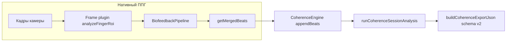

# Пайплайн «Когерентное дыхание»: от камеры до метрик и JSON-экспорта

Документ для **независимой проверки**: по нему можно сопоставить внешнее описание критериев (PDF со спецификацией практики и метрик) с реализацией в коде и с полями экспортируемого JSON. Исходные константы и формулы — в `modules/breath/core/coherence-constants.ts` и `modules/breath/core/coherence-session-analysis.ts`. Версия алгоритма когерентности в экспорте: `result` / `algorithmVersion` (см. `COHERENCE_ALGORITHM_VERSION`).

**Архитектура (актуально):** нативный ППГ идёт через **`BiofeedbackPipeline`** (`modules/biofeedback/bus/biofeedback-pipeline.ts`), а не через удалённый `FingerSignalAnalyzer`. Камера: **`FingerPpgCameraSource`** → сырые сэмплы в pipeline → **BiofeedbackBus** (каналы `optical`, `contact`, `pulseBpm`, `session`, …). Экран **`CoherenceBreathScreen`** подписан на шину через **`useBiofeedbackSnapshot`** и каналы; накопление ударов для сессии когерентности — в **`CoherenceEngine`** (`appendBeats` из merged-ряда pipeline). Полный обзор слоёв: `docs/biofeedback-architecture.md`.

---

## 1. Вход: камера и нативный ППГ

1. Кадры с задней камеры (частота зависит от устройства) обрабатываются плагином кадра (`analyzeFingerRoi` в `modules/biofeedback-finger-frame-processor`) → **`RawOpticalSample`** в **`BiofeedbackPipeline.pushOpticalSample`**.
2. **Оптика:** `OpticalRingBuffer` — детренд, оценка FPS, качество сигнала для детекции (`opt.signalQuality` внутри pipeline).
3. **Контакт:** `ContactMonitor` — состояние `absent | weak | present` и **уверенность присутствия пальца** `confidence` (0…1), публикуется в канал **`contact`**.
4. **Калибровка (внутри pipeline):** `CalibrationStateMachine`: `idle → contactSearch → warmup (10 с) → settle (10 с, нужна доля «хороших» тиков) → ready → lost`. Параметры: `WARMING_PHASE_MS`, `PULSE_SETTLE_MS`, `PULSE_SETTLE_GOOD_FRAC` в `modules/biofeedback/constants.ts`. Пока фаза **`warmup`** или раньше — **пик-детекция по ППГ не выполняется** (нет новых merged-ударов из оптики).
5. После выхода из прогрева pipeline — **детектор пиков** на полосовом сигнале, **`mergeBeatTimestampsPhase1`**, история ограничена константами слоя SIGNAL (`BEAT_HISTORY_WINDOW_MS`, `BEAT_DUPLICATE_TOLERANCE_MS` — см. `modules/biofeedback/constants.ts`).
6. **Merged-удары** — актуальный список на каждом кадре: **`BiofeedbackPipeline.getMergedBeats()`** (не полный лог «всей жизни» приложения, а скользящее окно).

**Шкала времени:** метки ударов и `timestampMs` сэмплов в нативном режиме — **время представления кадра / CMTime-подобная шкала**, не Unix-epoch. Для практики после успешного **экранного** QC задаётся **logical start** `practicePpgAnchorMs` = конец 5-секундного окна QC по времени камеры; окно `[anchor, anchor + 120 с]` — длительность практики (T=0). Для тахограммы и FFT в анализ передаются метки с `bufferMsBeforeSession` = 5 с до `anchor` (буфер QC / preflight).

---

## 2. Экран практики: маршрут и что попадает в анализ

Файл: `modules/breath/ui/CoherenceBreathScreen.tsx`.

### 2.1. Фазы UI (маршрут)

| Фаза UI | Условие перехода | Что происходит |
| --- | --- | --- |
| `idle` | Старт | Пользователь нажимает «Начать»: `pipeline.softReset()`, сброс `CoherenceEngine`. |
| `warmup` | Из `idle` | **10 с по системным часам** (`COHERENCE_WARMUP_MS`), без записи в `pulseLog`. Параллельно pipeline проходит свою калибровку (см. §1); пики из камеры в первые ~10 с по времени **pipeline** могут отсутствовать. |
| `qualityCheck` | После 10 с warmup | Окно **5 с по времени камеры** (`COHERENCE_QUALITY_WINDOW_MS`): на **конце** окна проверяются критерии (см. §2.2). При провале якорь окна сдвигается (`qcStartLogicalMsRef = camTs`). |
| `running` | Успешный QC | `CoherenceEngine.startSession({ sessionStartedAtMs: anchor, preflightBeats, bufferMsBeforeSession: 5 с, … })`, далее каждые ~250 мс `appendBeats(pipeline.getMergedBeats())`. |
| `results` | 120 с практики | `finalize`, экспорт JSON. |

Таймер **«Окно 5 с — осталось N с»** на экране считается по **той же** разнице `camTs − qcStart`, что и логика QC (не только декоративный текст).

### 2.2. Критерии прохождения QC (экран `qualityCheck`)

Оценка в **конце** 5-секундного интервала `[qcStart, qcStart + 5000]` по **времени камеры**:

| Критерий | Откуда в коде | Правильный замер |
| --- | --- | --- |
| `pulseLockState === "tracking"` | Канал `pulseBpm` / снимок | Pipeline считает lock **tracking**, если контакт **present**, качество достаточно для трека (`SignalQualityMonitor`), есть свежий удар, BPM в допустимом диапазоне, ритм «согласованный» (`PulseBpmEngine.looksCoherent`). |
| «Качество» > 70 % | **`useBiofeedbackSnapshot().signalQuality`** | В адаптере это **`contact.confidence`** — **уверенность контакта пальца** (`ContactMonitor`), не отдельное поле «SNR ППГ» в UI. Критерий: **> 0.7**. |
| ≥ 3 удара в окне | `getMergedBeats()` отфильтрованные в `[qcStart, winEnd]` | Merged-метки после детекции (после выхода pipeline из ранней фазы warmup). |

Если все три выполнены — `anchor = qcStart + 5000`, старт сессии когерентности.

### 2.3. Накопление ударов для отчёта (вместо старого `allSessionBeatsRef`)

| Шаг | Действие | Зачем |
| --- | --- | --- |
| A | Во время **`running`** вызывается **`CoherenceEngine.appendBeats(merged)`** с полным merged-списком из pipeline; внутри engine — **`dedupeBeatTimestampsMs(..., COHERENCE_BEAT_DEDUPE_MS)`** | Единый дедуп нарастающего ряда за сессию + preflight из QC. |
| B | По окончании 120 с: **`analysisStartMs` / `analysisEndMs`** по камере | Согласованы с `debug.sessionTimeBase` и `practicePpgAnchorMs`. |
| C | **`runCoherenceSessionAnalysis`** | Фильтр окна сессии + буфер, RR, тахограмма 4 Гц, FFT, RSA, вхождение — без дублирования математики вне `coherence-session-analysis.ts`. |

Промежуточные контрольные точки для отладки — в **`debug`** экспорта и в **`exportMeta`** (см. §5).

---

## 3. Промежуточные точки алгоритма (контрольный лист)

| Точка | Что измеряется | Критерий «измерение корректно» |
| --- | --- | --- |
| Сырой кадр | ROI пальца, средние RGB / luma | Сэмплы идут с растущим `timestampMs` (камера); при `camTs <= 0` QC/таймер не стартуют. |
| Контакт | `fingerPresenceConfidence` → `contact.state`, `confidence` | Приложенный палец: `present`, confidence обычно растёт; для QC UI нужно **> 0.7** (как proxy «качества» в подписи экрана). |
| Фаза калибровки pipeline | `session.phase` на шине | После **warmup** появляются merged-удары; до этого пиков из оптики нет — **норма**. |
| Merged-удары | Список меток пиков | Монотонность, шаг RR в разумных пределах; в JSON — размах `rawBeatMinMs`…`rawBeatMaxMs` покрывает сессию + буфер. |
| Lock пульса | `pulseLockState` | Для QC нужен **`tracking`** (не только `holding`). |
| Окно QC 5 с | Границы по `camTs` | После прохождения — **`practicePpgAnchorMs`** = конец окна; `analysisSessionEndMs − analysisSessionStartMs` ≈ **120000** мс. |
| RR / пранаяма | Очистка `cleanRrSequenceCoherence` | `rrBadFraction` в `exportMeta` низкая (< порога предупреждения 15 % при стабильном контакте). |
| Когерентность по секундам | FFT 60 с, `pwin/ptotal` | `tachogramSampleCount` на секундах практики достаточен (типично до 240 на 4 Гц в окне); первые секунды после буфера могут быть шумными — смотреть **сглаженный** ряд. |
| Время вхождения | 15 с подряд ≥ 40 % на **сглаженном** ряду | `entryTimeSec` не `null`; `maxConsecutiveSecondsAtOrAboveEntryThreshold` ≥ 15. |

Математика спектра, пороги Pwin/Ptotal, RSA, вхождение — по-прежнему в **`coherence-session-analysis.ts`** (соответствие PDF — §4 ниже).

---

## 4. Анализ сессии (соответствие PDF)

Файл: `modules/breath/core/coherence-session-analysis.ts`. Численные значения — в **`coherence-constants.ts`**.

1. **Фильтр окна сессии** — метки в `[sessionStartedAtMs - bufferMsBeforeSession, sessionEndedAtMs]`; `bufferMsBeforeSession` = `COHERENCE_PREFLIGHT_BUFFER_MS` (5 с).
2. **Дедупликация** — `dedupeBeatTimestampsMs(..., COHERENCE_BEAT_DEDUPE_MS)` (220 мс).
3. **RR и очистка (пранаяма)** — `cleanRrSequenceCoherence` в `tachogram-4hz.ts`; предупреждение при доле артефактов ≥ `RR_COHERENCE_WARN_FRACTION` (15 %).
4. **Тахограмма 4 Гц** — `TACHO_SAMPLE_RATE_HZ = 4`.
5. **Режим `test120s`** — окно спектра `TEST120_WINDOW_SECONDS` (60 с), `TEST120_WINDOW_SKIP_SECONDS` (0).
6. **Покомпонентно по секундам** — Pwin/Ptotal в диапазонах `PTOTAL_*`, `PWIN_*`, `mapCoherenceRatioToPercent`.
7. **Сглаживание** — `SMOOTH_WINDOW_SECONDS` (3 с), медиана.
8. **Агрегаты** — среднее/макс. по секундам после skip (для test120s — 0).
9. **RSA** — по циклам дыхания; неактивный цикл при `rsaBpm < RSA_CYCLE_MIN_BPM`.
10. **Нормированная RSA** — см. комментарии в коде и `exportMeta.rsaNormalizedPercent`.
11. **Время вхождения** — `ENTRY_STABILITY_SECONDS` (15 с) при `COHERENCE_ENTRY_THRESHOLD_PERCENT` (40 %).

---

## 5. Поток данных (схема)

---

## 6. Структура JSON-экспорта (`schemaVersion: 2`)

Формируется через **`CoherenceEngine.buildExportJson`** → **`buildCoherenceExportJson`** в `coherence-session-analysis.ts`. Детальный полный след событий шины и движков — в отдельном экспорте **v3** (`modules/biofeedback/export/SessionExporter.ts`), если включён в пробе.

| Поле верхнего уровня | Содержание |
| --- | --- |
| `schemaVersion` | `2`: в `beats` — `timestampsMsWindowFiltered` и `timestampsMsAnalyzed`. |
| `exportedAtMs` | Время выгрузки файла (Unix). |
| `algorithmVersion` | Версия когерентностного анализа. |
| `dataSource` | `fingerPpg` \| `simulated`. |
| `debug` | Якорь, wall-clock старта, счётчики колбэков, длины массивов до/после фильтра окна и дедупа (`CoherenceExportDebug`). |
| `pulseLog` | Редкий лог (~2 Гц wall-clock): пульс, **signalQuality в логе** (как на момент снимка), `pulseLockState`, `beatTimestampsCount` — **длина merged в pipeline**, не число ударов «за всю жизнь». |
| `session` / `beats` / `result` | Как раньше: окно, дедуп, `CoherenceSessionResult`, `exportMeta`. |

### 6.1. Поля `result.exportMeta` (диагностика качества)

| Поле | Смысл |
| --- | --- |
| `beatsAfterWindowFilter`, `beatsAfterDedupe`, `beatDedupeToleranceMs` | Сколько меток прошло фильтр и дедупликацию. |
| `bufferMsBeforeSession` | Буфер QC перед T=0 (мс). |
| `practiceBeatCount`, `practiceBeatSpanMs` | Удары только в окне практики `[T0, T0+120 с]` и размах времени между крайними метками. Ожидается `practiceBeatSpanMs` порядка **~115–120 с** при стабильном ритме ~60–90 уд/мин. |
| `rrBadFraction`, `rrCoherenceWarnFraction` | Доля заменённых RR и порог предупреждения. |
| `maxConsecutiveSecondsAtOrAboveEntryThreshold` | Максимум подряд секунд (на сглаженном ряду) с когерентностью ≥ порога вхождения. |

### 6.2. Почему `entryTimeSec` может быть `null`

См. прежнюю логику: нужна **непрерывная** серия **15 с** ≥ **40 %** на **`perSecondSmoothed`**. Типичные причины `null` — короткие пики когерентности, мало точек тахограммы в окне FFT, длинные нули в `perSecond`.

### 6.3. Что проверить в JSON на «подозрительность»

1. **`debug.rawBeatMinMs` / `rawBeatMaxMs`** — размах ~ буфер + 120 с + хвост merged.
2. **`analysisSessionEndMs - analysisSessionStartMs`** ≈ **120000** мс.
3. **`result.perSecond[].tachogramSampleCount`** — на большинстве секунд практики достаточно точек; нули возможны на краях или при сбоях.
4. **`pulseLog.beatTimestampsCount`** — скользящая длина merged, не «всего ударов за 120 с».

---

## 7. Соответствие PDF и коду

| Тема в PDF | Где в коде |
| --- | --- |
| Частота тахограммы | `TACHO_SAMPLE_RATE_HZ` |
| Окна test120s | `TEST120_*`, `mode` |
| Порог артефактов RR | `RR_ARTIFACT_DEVIATION`, предупреждение `RR_COHERENCE_WARN_FRACTION` |
| Диапазоны Pwin / Ptotal | `PWIN_*`, `PTOTAL_*` |
| Порог вхождения | `COHERENCE_ENTRY_THRESHOLD_PERCENT`, `ENTRY_STABILITY_SECONDS` |
| RSA | `RSA_CYCLE_MIN_BPM`, `rsaNormalizedPercent` |

---

## 8. Известные ограничения

- **`pulseLog`** не содержит полного списка ударов — только счётчик и метрики снимка; полные массивы — в **`beats`** и производных в **`result`**.
- В UI подпись «кач. X %» на экранах калибровки берётся из **уверенности контакта** (`contact.confidence` в адаптере), а не из отдельного поля «SNR оптики» — см. §2.2.
- Симуляция RR обходит нативный ППГ; в JSON `dataSource: "simulated"`.
- Расширенный отладочный экспорт с шиной — **`schemaVersion: 3`** (модуль biofeedback), не путать с **`schemaVersion: 2`** отчёта когерентного дыхания.

---

## 9. Контрольный чеклист по одному экспорту (ручная валидация)

1. **Длительность:** `analysisSessionEndMs - analysisSessionStartMs` = **120000** ± допуск на последний удар.
2. **Покрытие ударами:** `practiceBeatSpanMs` ≈ **115–120 с**; `practiceBeatCount` согласован с средним ЧСС (~120 с × BPM/60).
3. **Очистка RR:** `rrBadFraction` < **0.15** при хорошем контакте.
4. **Вхождение:** если `entryTimeSec` число — на `perSecondSmoothed` видна серия ≥ **15** с подряд ≥ **40 %**; `maxConsecutiveSecondsAtOrAboveEntryThreshold` согласован.
5. **Согласованность массивов:** длина `beats.timestampsMsAnalyzed` = `beatsAfterDedupe` в `exportMeta` (при том же окне фильтра).

При выполнении пунктов можно считать, что **цепочка от merged-ударов до метрик** отработала согласованно; отдельно оценивают **биомеханику** (стабильность пальца, редкие `holding` в `pulseLog`).
