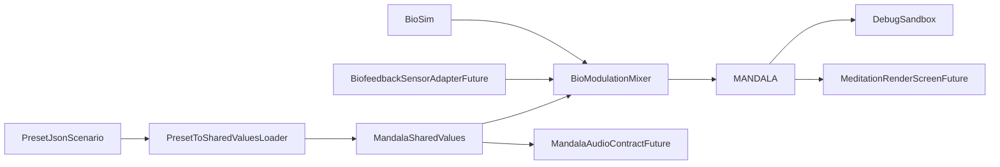

# Техническое задание: генератор видео-медитаций

## 1. Назначение

Генератор видео-медитаций отвечает за процедурное создание визуального ряда на устройстве без предзаписанного видео. Первая фаза разработки фокусируется на визуальной системе и отладочном контуре:

- единый `MANDALA` на `Skia`;
- `Preset JSON` как сценарий медитации;
- загрузка пресета в `SharedValues` при старте сессии;
- `BioSim` как fail-safe поток биосигналов;
- `Debug Sandbox` для ручной настройки всех значимых параметров;
- контракт будущего `MandalaAudioEngine`, но без полной реализации аудио в этой фазе.

## 2. Почему исходное ТЗ было скорректировано

Исходный текст содержал несколько архитектурных конфликтов:

- `MANDALA_GENERATOR` и `MANDALA_SHADER` были описаны как отдельные runtime-модули, хотя в `Skia` это одна визуальная система.
- JSON одновременно использовался и как сценарий, и как live-состояние, что приводило бы к конфликтам с биомодуляцией.
- Одни и те же биосигналы влияли на одни и те же параметры в разных местах без единого правила приоритета.
- аудио-движок был описан как обязательная часть первой поставки, хотя в текущем Expo-проекте нет готового production-контура для JSI/audio-worklets.

Поэтому новая спецификация разделяет уровни ответственности и делает систему устойчивой для дальнейшего подключения реального PPG, камеры и аудио.

## 3. Архитектура первой фазы



## 4. Главные модули

### 4.1 `MANDALA`

Единый runtime-модуль визуализации. Он объединяет:

- математический генератор форм;
- `Skia` shader/runtime effect;
- топологии и sacred presets;
- morphing между топологиями;
- объединение базового пресета и био-модуляции.

`MANDALA` не делится на отдельные runtime-модули `generator` и `shader`, потому что форма, кинетика, цвет, священные пресеты и live-модуляция вычисляются в одной графической системе.

### 4.2 `Debug Sandbox`

Отдельный dev/debug-экран. Он нужен для ручного подбора параметров до подключения реального биофидбека. Пользователь должен иметь возможность:

- менять topology, primitives, complexity, imperfection, appearance, modulation, kinetics;
- выбирать sacred presets;
- менять `bio_weight`;
- включать и выключать `BioSim`;
- нажимать кнопку `Применить`, после чего значения из текущего JSON-сценария переносятся в `SharedValues`, а визуал обновляется сразу.

### 4.3 `BioSim`

Fail-safe источник биосигналов. Если сенсор не подключен или сигнал плохого качества, система не должна замирать. Вместо этого используются мягкие идеализированные сигналы:

- дыхание: `0.33 Hz`;
- пульс: `1.10 Hz`;
- `rmssd`: среднее нормализованное значение `0.5–0.6`;
- `stressIndex`: среднее нормализованное значение `0.3–0.5`.

### 4.4 `MandalaAudioEngine`

В первой фазе не реализуется полностью. Вместо этого фиксируется контракт, который будущий аудио-модуль будет читать из runtime-состояния:

- `target_hz`;
- состояние диапазона `alpha/theta/delta`;
- относительная яркость / плотность;
- будущий `foundationLayerHz`;
- события переходов для гонгов.

## 5. Источник истины

### 5.1 `Preset JSON` только как сценарий

JSON используется только как сценарий или пресет. Он не является live-хранилищем.

При запуске медитации:

1. JSON читается как `MeditationPresetScenario`.
2. Активный keyframe нормализуется и санитизируется.
3. Значения копируются в `SharedValues`.
4. Далее `MANDALA` работает уже с runtime-состоянием.

### 5.2 `SharedValues` как runtime-слой

Именно `SharedValues` становятся источником истины во время сессии. Это позволяет:

- плавно интерполировать параметры;
- подключать биомодуляцию без мутации исходного JSON;
- переиспользовать тот же runtime для sandbox, боевого экрана и будущего аудио-модуля.

## 6. Формула разделения базового ритма и биомодуляции

Во всех случаях нужно строго разделять:

- `baseValue` из пресета;
- `bioDelta` из сенсора или `BioSim`;
- `bioWeight` как коэффициент влияния.

Базовая формула:

```ts
finalValue = baseValue + bioWeight * bioDelta
```

Где:

- `bioWeight = 0` означает полный показ пресета без сенсора;
- `bioWeight = 1` означает полный контроль со стороны биосигнала;
- для медитации по умолчанию используются мягкие значения `0.15–0.35`.

### 6.1 Роли биосигналов

Чтобы исключить конфликты:

- дыхание управляет пространством и масштабом;
- пульс управляет микро-свечением, яркостью и энергетическим акцентом;
- `HRV` управляет гармонией, сглаживанием и снижением перегруженности;
- `stressIndex` управляет энтропией, асимметрией и степенью визуального зацепления.

Если один sacred preset допускает влияние дыхания и пульса на близкие параметры, приоритет должен задаваться не условными исключениями, а явной формулой маппинга внутри `BioModulationMixer`.

## 7. Runtime-сущности

### 7.1 `MeditationPresetScenario`

Сценарий всей медитации:

- `id`
- `title`
- `description`
- `durationSeconds`
- `keyframes[]`

### 7.2 `MeditationPresetKeyframe`

Один ключевой кадр сценария:

- `id`
- `timestamp`
- `duration`
- `geometry`
- `primitives`
- `complexity`
- `imperfection`
- `appearance`
- `modulation`
- `kinetics`
- `bioWeights`

### 7.3 `MandalaSessionState`

Runtime-состояние активной сессии после загрузки в `SharedValues`.

### 7.4 `BioSignalFrame`

Нормализованный пакет биосигналов:

- `breathPhase`
- `pulsePhase`
- `breathRate`
- `pulseRate`
- `rmssd`
- `stressIndex`
- `signalQuality`
- `source`

### 7.5 `MandalaArtDirectionState`

Художественный слой поверх сырых параметров. Он нужен, чтобы пользователь исследовал не десятки конфликтующих чисел, а более понятные режимы образов:

- `visualRecipe`
- `layerCount`
- `ornamentDensity`
- `depthStrength`
- `glowStrength`
- `revealMode`
- `palettePreset`

## 8. Блоки параметров пресета

### 8.1 `geometry`

#### Topology

- `topologyType`
  - `0` Concentric
  - `1` Radial
  - `2` Spiral
  - `3` Lattice
  - `4` Sacred
- `ringDensity`: `1.0–50.0`
- `progressionMode`
  - `0` Linear
  - `1` Exp
  - `2` GoldenRatio
- `beamCount`: `3–64`
- `aperture`: `0.1–1.0`
- `twistFactor`: `-10.0–10.0`
- `spiralOrder`: `1–12`
- `gridType`
  - `0` Round
  - `3` Trigonal
  - `4` Square
  - `6` Hexagonal
- `sacredPreset`
  - `1` FlowerOfLife
  - `2` SriYantra
  - `3` MetatronCube
- `overlapFactor`: коэффициент пересечения кругов для `FlowerOfLife` и `MetatronCube`
- `lineMask`: битовая маска для `MetatronCube`, диапазон `0–31`
- `binduSize`: размер центральной точки для `SriYantra`

### 8.2 `primitives`

- `curvature`: `0.0–1.0`
- `vertices`: `3–20`
- `strokeWidth`: `0.001–0.1`
- `complexity`: `0.0–1.0`

### 8.3 `complexity`

- `fractalDimension`: `1.05–1.6`
- `recursionDepth`: `1–5`

### 8.4 `imperfection`

- `symmetryDeviation`: `0.0–1.0`

### 8.5 `appearance`

- `hueMain`: `0–360`
- `hueRange`: `0–120`
- `saturation`: `0.0–1.0`
- `luminanceBase`: `0.0–1.0`
- `ganzfeldMode`: `boolean`

### 8.6 `modulation`

- `targetHz`: `0.5–15.0`
- `waveform`
  - `0` Sine
  - `1` Square
  - `2` Sawtooth
- `dutyCycle`: `0.1–0.9`

### 8.7 `kinetics`

- `zoomVelocity`: `-2.0–2.0`
- `rotationVelocity`: `-5.0–5.0`
- `motionLogic`
  - `0` Linear
  - `1` Logarithmic
  - `2` PhiPulse
- `morphTarget`: target topology для плавного перетекания

### 8.8 `bioWeights`

- `breathToScale`
- `pulseToGlow`
- `rmssdToComplexity`
- `stressToEntropy`

Все значения нормализованы в диапазоне `0.0–1.0`.

### 8.9 `artDirection`

- `visualRecipe`
  - `lotusBloom`
  - `tunnelBloom`
  - `yantraPulse`
  - `fractalBloom`
  - `metatronPortal`
- `layerCount`: `1–6`
- `ornamentDensity`: `0.0–1.0`
- `depthStrength`: `0.0–1.0`
- `glowStrength`: `0.0–1.0`
- `revealMode`
  - `centerBloom`
  - `irisWave`
  - `pulseGate`
- `palettePreset`
  - `midnightGold`
  - `violetMist`
  - `emeraldDream`
  - `sunsetRose`

## 9. Sacred presets в единой системе

`FlowerOfLife`, `SriYantra` и `MetatronCube` не являются отдельным генератором. Они входят в общий `geometry`-слой и используют те же:

- `appearance`;
- `modulation`;
- `kinetics`;
- `bioWeights`;
- runtime-биосигналы.

Это значит:

- sacred preset можно вращать так же, как любую другую топологию;
- sacred preset может морфить к другой топологии;
- sacred preset использует те же правила `BioModulationMixer`.

## 10. Правила биомодуляции

### 10.1 Дыхание

Используется для:

- `overlapFactor` в `FlowerOfLife` / `MetatronCube`;
- масштаба;
- мягких пространственных расширений и сжатий.

### 10.2 Пульс

Используется для:

- пульсации центральных акцентов;
- микро-свечения;
- дополнительной модуляции мерцания.

### 10.3 HRV

Используется для:

- уменьшения перегруженности;
- сглаживания формы;
- снижения плотности паттерна при расслаблении.

### 10.4 Stress

Используется для:

- повышения энтропии;
- повышения асимметрии;
- усиления визуального зацепления, если пользователь еще не стабилизировался.

## 11. `BioSim` и будущий `BiofeedbackSensorAdapter`

Оба источника должны отдавать один и тот же контракт `BioSignalFrame`. Это критично, чтобы замена симуляции на реальный PPG не требовала переписывать `MANDALA`.

### 11.1 Нормализация

Нормализация выполняется на клиенте:

- `pulseRate`: `40–180 bpm -> 0..1`
- `breathRate`: `5–30 bpm -> 0..1`
- `HRV`: `20–200 ms -> 0..1`
- `stressIndex`: `0–100 -> 0..1`

### 11.2 Fail-safe

Если биосигнал потерян:

- `breathPhase` эмулируется синусоидой `0.33 Hz`;
- `pulsePhase` эмулируется синусоидой `1.10 Hz`;
- `rmssd` и `stressIndex` плавно возвращаются к средним значениям;
- изображение не останавливается.

## 12. `Debug Sandbox`

Sandbox обязателен в первой фазе. Он должен включать:

- экран предпросмотра `Skia`-мандалы;
- понятные поля ввода для всех блоков параметров;
- переключатели enum-параметров;
- `BioSim enabled`;
- поля частот `BioSim`;
- кнопку `Применить в SharedValues`;
- кнопку сброса;
- диагностический блок с текущими нормализованными биоданными;
- диагностический блок с будущим аудио-контрактом.

## 13. Будущий `MandalaAudioEngine`

Полная реализация откладывается на следующую фазу, но контракт фиксируется сейчас.

Будущий модуль должен уметь:

- читать `targetHz`;
- определять диапазоны `alpha/theta/delta`;
- управлять foundation drone, texture layers и gong triggers;
- синхронизироваться с переходами между keyframes;
- использовать те же `BioSignalFrame`, что и визуальный модуль.

Причина отложить реализацию:

- текущий репозиторий не содержит готового production-контура для `audio worklets / JSI`;
- первая поставка должна подтвердить качество визуальной части и корректность параметров;
- после стабилизации `Debug Sandbox` можно будет безопасно подключать звук поверх уже готовых контрактов.

## 14. Ограничения первой фазы

- Используется только локальный procedural visual runtime.
- Нет записи видеофайла.
- Нет полноценного аудио-движка.
- Нет реального PPG.
- Нет `MandalaTranslator` для перевода психологического запроса в пресет.

## 15. Критерий готовности первой фазы

- В проекте есть отдельный модуль `MANDALA`.
- В `docs/` лежит согласованное ТЗ без противоречий.
- Есть отдельный sandbox-экран для live-настройки.
- `Preset JSON` переносится в `SharedValues`.
- `BioSim` поддерживает живое поведение без камеры.
- Структура данных уже совместима с будущими `BiofeedbackSensorAdapter`, `MandalaTranslator` и `MandalaAudioEngine`.
